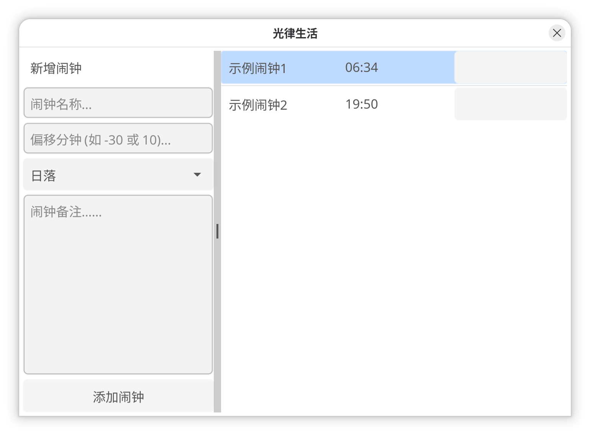

# AuraClock

[简体中文](README.md) | [English](README_EN.md)

## 介绍

人的生物种并不是按照标准时间设定的，而是通过日出、日落带来的一系列环境变化动态决定的。本软件根据经纬度自动获取日出、日落时间并根据用户设定的时间差值来计算日常事物的时间点，保证其更加契合生物钟，以此带来工作状态的提升。

## 运行

本软件使用跨平台的 GUI 框架 Fyne，因此只需在本地编译即可运行。`target` 目录下有一份 X86_64 架构、Linux 系统的编译产物，若环境符合，下载后可直接运行。

尝试运行：

```shell
go run .
```

编译为二进制文件：

```shell
go build .
```

初次运行或编译时，Go 会准备编译环境（主要是第三方库），请耐心等待。

## 使用

本软件默认以 GUI 形式运行，也可以通过选项来使用命令快速操作。本软件将会把所有闹钟数据保存到当前目录下的 `GUI.json`。

### GUI

本软件界面非常直观：



* 左侧可以设定新闹钟的名称、偏移时间（分钟）、备注，点击“添加闹钟”即可添加。
* 右侧会显示当前 `GUI.json` 中的所有闹钟，点击灰色按钮即可删除。

所有更改将会在软件退出时更新到 `GUI.json`。

### CLI 选项

* 选项 `a`

  * 输入：浮点数
  * 作用：设定纬度（默认北京） `(default 39.906)`

* 选项 `l`

  * 输入：浮点数
  * 作用：设置经度（默认北京） `(default 116.391)`

* 选项 `n`

  * 作用：只使用创建闹钟的基础功能

* 选项 `r`

  * 输入：文件地址（字符串）
  * 作用：指定读取的文件中的闹钟

* 选项 `w`

  * 输入：文件地址（字符串）
  * 作用：创建闹钟并写入指定文件

## todos

* 改善 GUI：GUI 有很多需要改进的细节

  * 删除按钮没有文字说明。
  * 漂移时间直接输入数字有些繁琐，可以添加选择器。
* GUI 增加功能：

  * 选定读取、写入的文件
* 用户配置文件：

  * 可以单独保存偏好、设定（如经纬度）。

